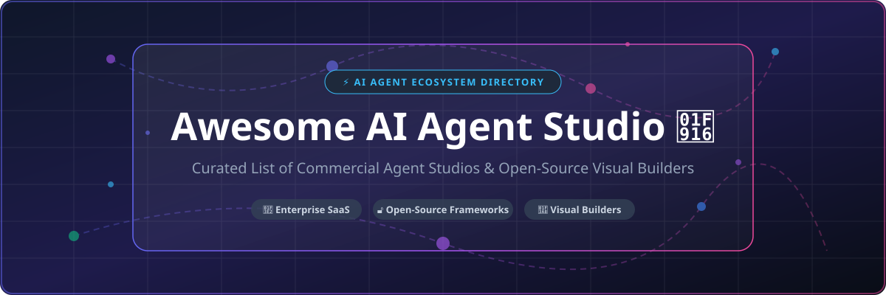

# Awesome-AI-Agent-Studio

# Awesome-AI-Agent-Studio 🤖 🎬

  

  
  
  
  
  
  

---

## 🌟 Top AI Agent Studio Ecosystem

**Curated List of Commercial Agent Studios & Open-Source Visual Agent Builders**  
*Focused on Visual Workflow Editors, Multi-Agent Prototyping, Low-Code Agent Development, Agent Debugging & Self-Hosted Agent Studios*

**Last updated: October 2026** 📅

---

### 📌 Overview & SEO Summary
Welcome to the ultimate curated directory of **AI agent studios**, **open-source visual agent builders**, and **multi-agent development environments**. Whether you are looking for enterprise-grade commercial solutions (such as *Salesforce Agentforce Studio*, *CrewAI Cloud*, and *LangGraph Studio*), or self-hostable open-source alternatives (like *AutoGen Studio*, *Flowise*, and *Giselle*), this list covers category leaders, visual workflow editors, and privacy-respecting agent development.

**Key Market Context:**
- **Salesforce Agentforce Studio** is the **central hub for building, modifying, testing, and monitoring AI agents** within the Salesforce AI platform, enabling low-code development for admins, developers, and business analysts [citation:1].
- **CrewAI** offers a **visual editor and AI copilot** with a **free tier for 50 workflow executions/month**, and **enterprise governance with SSO, RBAC, and PII redaction** [citation:2].
- **AutoGen Studio** is a **no-code developer tool for rapidly prototyping, debugging, and evaluating multi-agent workflows**, with a **drag-and-drop interface, interactive debugging, and a gallery of reusable components** [citation:3][citation:13].
- **LangGraph Studio** (part of LangGraph Platform, now LangSmith Deployment) is the **built-in agent IDE for visualizing, debugging, and testing agent workflows in real time**, with **built-in checkpointing and memory modules for rewinding and rerunning failure points** [citation:6][citation:16].
- **Giselle** is an **open-source AI agent studio** with a **visual drag-and-drop agent builder**, **multi-model composition (GPT, Claude, Gemini)**, and **GitHub AI operations** [citation:20].

---

## 📑 Table of Contents
- [🏢 SaaS & Commercial Platforms](#-saas--commercial-platforms)
- [🔓 Open-Source GitHub Projects](#-open-source-github-projects)
- [🛠️ How to Contribute](#%EF%B8%8F-how-to-contribute)
- [📊 Star History](#-star-history)
- [🤝 Support & Sponsorship](#-support--sponsorship)
- [⚠️ Disclaimer](#%EF%B8%8F-disclaimer)

---

## 🏢 SaaS / Commercial Platforms

The AI agent studio market spans **enterprise CRM-integrated studios** (Salesforce Agentforce Studio) that unify **agent creation, testing, and monitoring within existing platforms**, **multi-agent orchestration platforms** (CrewAI Cloud, LangGraph Platform) that provide **visual editors and managed runtimes**, and **no-code/Low-code agent builders** (Botpress Studio, Lindy AI) that emphasize **accessibility for business users**. **Salesforce Agentforce Studio** is **free to browse** with **usage-based billing** [citation:1]. **CrewAI** offers a **free tier with 50 workflow executions/month** and **custom enterprise pricing** [citation:2]. **Lindy AI** starts at **$30/month per user** (Plus) with **credits pooled across the workspace** [citation:7]. **LangGraph Platform** offers **1-click deployment** with **SaaS, hybrid, or fully self-hosted options** [citation:16].

| SaaS / Commercial Platform | Company / Owner | Valuation / Market Cap | Standard Edition Starting Price | Free Tier / Free Trial Limits | Description |
| :--- | :--- | :--- | :--- | :--- | :--- |
| **[Salesforce Agentforce Studio](https://www.salesforce.com/agentforce/)** ☁️ | Salesforce | ~$250 Billion | **Usage-based billing** | **Free: browse and build with Flex Credits** | **Enterprise agent studio** — **Central hub for creating, modifying, testing, and monitoring AI agents** [citation:1]. **Low-code development for admins, developers, and business analysts**. **Built on Data 360 with real-time CRM data**. **Field Generation Prompt Templates** for automated summaries [citation:11]. |
| **[CrewAI Cloud](https://crewai.com/)** 👥 | CrewAI | Private | **Custom enterprise pricing** | **Free: 50 workflow executions/month** | **Multi-agent orchestration studio** — **Visual editor and AI copilot** [citation:2]. **GitHub integration**. **Enterprise governance with SSO, RBAC, PII redaction, and policies**. **Deploy on CrewAI cloud, your VPC, or your infrastructure**. **45-day onboarding for enterprise** [citation:2]. |
| **[LangGraph Platform (LangSmith Deployment)](https://www.langchain.com/)** 🕸️ | LangChain | Private | **Usage-based pricing** | **Free tier available** | **Agent deployment and management studio** — **1-click deployment with GitHub integration** [citation:6]. **LangGraph Studio for visualizing, debugging, and testing agent workflows in real time**. **Built-in checkpointing and memory for rewinding and rerunning failure points**. **Agent registry for discovering and reusing agent architectures** [citation:16]. |
| **[Botpress Studio](https://botpress.com/)** 💬 | Botpress | Private | **Custom pricing** | **Free tier available** | **Visual agent development environment** — **Drag-and-drop canvas for conversation flows, branching logic, and multi-step automations** [citation:5]. **Autonomous Engine for LLM-based decision-making**. **Knowledge Bases for grounded answers**. **Tables for structured data persistence**. **Custom code actions** [citation:5]. |
| **[Lindy AI](https://www.lindy.ai/)** 🧑‍💼 | Lindy | Private | **$30/user/month** (Plus) | **7-day free trial via Slack** | **AI teammate studio** — **Works in Slack, iMessage, and email** [citation:17]. **Credits pooled across workspace**. **1,000+ app integrations**. **SOC 2 Type II, HIPAA, GDPR compliant**. **Credits do not roll over** [citation:7][citation:17]. |
| **[AgentOps](https://www.agentops.ai/)** 📊 | AgentOps | Private | **Free tier available** | **Free: limited sessions** | **Agent testing, debugging, and deployment platform** — **Session replays, metrics, and monitoring for AI agents** [citation:8]. **Tracks LLM calls, costs, latency, agent failures, multi-agent interactions, and tool usage**. **Open-source app available** [citation:8]. |
| **[SuperAGI](https://superagi.com/)** 🦾 | SuperAGI | Private | **Custom pricing** | **Free trial available** | **Autonomous agent framework with GUI** — **Provision, spawn, and deploy autonomous AI agents** [citation:9]. **Toolkits marketplace**. **Action console for agent interaction**. **Performance telemetry and agent memory storage**. **ReAct LLM workflows** [citation:9]. |
| **[Stack AI](https://www.stack-ai.com/)** 📚 | Stack AI | Private | **Custom pricing** | **Free trial available** | **Enterprise agent studio** — **No-code agent development with enterprise security**. **Document processing and RAG**. |
| **[Voiceflow](https://www.voiceflow.com/)** 🎙️ | Voiceflow | Private | **$60/month** (Pro) | **Free: 2 agents, 1,000 interactions/month** | **Conversational agent studio** — **Design, prototype, and launch chat and voice agents**. **Collaborative team workspace**. |
| **[SmythOS Studio](https://smythos.com/)** 🛠️ | SmythOS | Private | **Free: open-source** | **Free: open-source** | **Open-source visual AI agent builder** — **Drag-and-drop workspace with custom code extension** [citation:10]. **Deployable runtime stack for local, cloud, or edge**. **Full governance and control** [citation:10]. |

---

## 🔓 Open-Source GitHub Projects

*Sorted by GitHub_Stars_Count (Descending)* 🌟

- **[Dify](https://github.com/langgenius/dify)**   
  **LLMOps platform with agentic workflows**, Apache-2.0 licensed. **157K+ GitHub stars** — **the leading open-source visual agent builder**. **Visual drag-and-drop workflow builder**. **Built-in RAG pipelines and agent nodes**. **100+ LLM providers**. **Self-hosted or Dify Cloud**. 🎨

- **[n8n](https://github.com/n8n-io/n8n)**   
  **Workflow automation with AI capabilities**, Sustainable Use License. **176K+ GitHub stars** — **the most popular open-source automation platform**. **AI Workflow Builder with plain English prompts**. **400+ integrations**. **Self-hosted with unlimited executions**. 🔄

- **[Langflow](https://github.com/langflow-ai/langflow)**   
  **Visual framework for building multi-agent and RAG applications**, MIT licensed. **100K+ GitHub stars** — **the most accessible visual agent builder**. **Drag-and-drop interface for LangChain components**. **Built-in RAG pipelines**. 🎯

- **[MetaGPT](https://github.com/geekan/MetaGPT)**   
  **Multi-agent framework with role-based collaboration**, MIT licensed. **70K+ GitHub stars** — **agents role-play a software company**. **The most popular multi-agent orchestration framework**. 🏢

- **[AutoGen Studio](https://github.com/microsoft/autogen)**   
  **No-code multi-agent workflows**, CC-BY-4.0 licensed. **61K+ GitHub stars** — **AutoGen Studio for rapid prototyping, debugging, and evaluating multi-agent workflows** [citation:3]. **Drag-and-drop interface for agent workflow composition**. **Interactive debugging capabilities**. **Gallery of reusable agent components**. **Export and share workflows via Git or API endpoints** [citation:13]. **Not production-ready — expect breaking changes** [citation:3]. 🏛️

- **[CrewAI](https://github.com/crewAIInc/crewAI)**   
  **Framework for orchestrating role-playing autonomous AI agents**, MIT licensed. **59K+ GitHub stars** — **the fastest framework to prototype with**. **Role-based DSL**. **Free for self-hosted deployments**. 👥

- **[CAMEL](https://github.com/camel-ai/camel)**   
  **Role-playing agents for studying agent society**, Apache-2.0 licensed. **17K+ GitHub stars** — **the first multi-agent framework**. **Agent society simulation**. 🐪

- **[PraisonAI](https://github.com/MervinPraison/PraisonAI)**   
  **Multi-agent workflows with self-reflection**, MIT licensed. **9K+ GitHub stars**. **100+ LLM support**. **Self-reflection for improved outputs**. 🔄

- **[OpenAgents](https://github.com/xlang-ai/OpenAgents)**   
  **Agent networks over WebSocket, gRPC, MCP and A2A**, Apache-2.0 licensed. **4K+ GitHub stars**. **Open protocol for agent communication**. 🌐

- **[Giselle](https://github.com/giselles-ai/giselle)**   
  **Open-source AI agent studio for agentic workflows**, Apache-2.0 licensed. **Visual agent builder with drag-and-drop interface** [citation:20]. **Multi-model composition (GPT, Claude, Gemini)**. **GitHub AI operations for issues, PRs, and deployments**. **Knowledge store with GitHub vector store integration**. **Cloud with 30 minutes free Agent time/month** [citation:20]. 🎬

- **[SuperAGI](https://github.com/Seniaxz/SuperAGi)**   
  **Open-source autonomous AI agent framework with GUI**, open-source. **Provision, spawn, and deploy autonomous agents** [citation:9]. **Toolkits marketplace**. **Action console for agent interaction**. **Multiple vector DBs**. **Performance telemetry and agent memory**. 🦾

- **[SmythOS Studio](https://github.com/SmythOS/smythos-studio)**   
  **Open-source visual AI agent builder and deployable runtime stack**, open-source. **Intuitive drag-and-drop workspace** [citation:10]. **Extend with custom code**. **Deploy locally, cloud, or edge with full governance and control** [citation:10]. 🛠️

- **[Atomic Agent](https://github.com/AtomicBot-ai/atomic-agent)**   
  **Local-first CLI agent for open-weight models**, MIT licensed. **2.7K+ GitHub stars**. **Runs locally with open-weight models**. 🖥️

- **[Flock](https://github.com/whiteducksoftware/flock)**   
  **Declarative agents via blackboard architecture**, MIT licensed. **122 GitHub stars**. **Declarative agent definitions**. 🐑

---

## 🛠️ How to Contribute

Contributions are welcome! Follow these steps to submit new AI agent studio platforms or open-source agent builder software:

1. 🍴 **Fork** the repository.
2. 📝 **Add/edit** entries in `README.md` maintaining table/list structure and formatting.
3. 🔗 Include project title, official website/GitHub link, exact Stars_Count, license, and brief description.
4. 🚀 Submit a **Pull Request** with a descriptive summary of your changes.

---

## 📊 Star History

---

## 🤝 Support & Sponsorship

If you find this AI agent studio repository useful, please consider supporting the project:

- ⭐ **Star** this repository to increase visibility!
- 🔀 **Fork** and share with fellow AI engineers, developers, and open-source advocates.
- ☕ **Sponsor & Buy Me a Coffee**: Support ongoing open-source curation via the [GitHub Sponsor Dashboard](https://github.com/sponsors/ishandutta2007).

---

## ⚠️ Disclaimer

- This is a **community-curated** list — not exhaustive and not an endorsement. ℹ️
- **Salesforce Agentforce Studio is the central hub for AI agent development** within the Salesforce AI platform, enabling low-code development [citation:1]. **CrewAI offers a free tier with 50 workflow executions/month** and **enterprise governance with SSO and RBAC** [citation:2]. **LangGraph Studio provides real-time debugging with checkpointing and memory rewinding** [citation:6].
- **AutoGen Studio is under active development and not meant to be a production-ready app** — expect breaking changes [citation:3]. **Lindy credits do not roll over** and **HIPAA with signed BAA, SSO, and audit logs are limited to Enterprise plans** [citation:17].
- **Open-source agent studios are not turnkey** — they require **deployment, model API configuration, and ongoing maintenance**. **Dify requires PostgreSQL, Redis, and a vector database**. **AutoGen Studio requires SQLite/PostgreSQL and Python 3.10+**. **Always validate agent workflows and security with a proof-of-concept** before production deployment. 🤖

---

  <b>Made with ❤️ for AI engineers, developers, and open-source agent studio advocates.</b>

